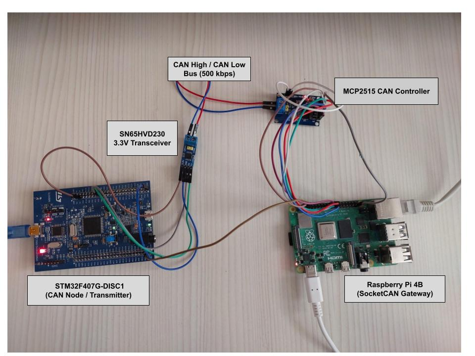

# stm32-uds-bootloader

A CAN bootloader for STM32F407 implementing UDS (ISO 14229-1) over ISO-TP (ISO 15765-2) for firmware updates, written from scratch (no third-party ISO-TP/UDS libraries).

> **Status:** core update pipeline works end-to-end on real hardware. The final jump from bootloader to application is unreliable — see [Known issues](#known-issues). This is the honest state, not a demo-polished one.

## Why this project

Field firmware updates over CAN are standard in automotive ECUs. The interesting engineering problem isn't "send bytes over CAN" — it's segmenting a multi-KB image into 8-byte CAN frames correctly, running a stateful diagnostic session on top of that, writing flash safely, and handing off execution to new code without the hardware's own caches lying to you. This project builds that path by hand: ISO-TP segmentation/reassembly, a UDS service state machine, a flash driver, and CRC32-based integrity verification.

It follows my earlier [vehicle CAN bus simulator](LINK_TO_YOUR_CAN_SIMULATOR_REPO) project (STM32 + Raspberry Pi, SocketCAN).

## Architecture

```
 Raspberry Pi (update_client.py)               STM32F407 target
 ┌───────────────────────────────┐            ┌──────────────────────────────┐
 │ firmware.bin + CRC32          │            │ Bootloader                   │
 │ ISO-TP segmentation           │  CAN bus   │  UDS server, ISO-TP RX/TX,   │
 │ UDS client (request/response) │◄──────────►│  flash driver, CRC check,    │
 │ python-can / SocketCAN        │            │  boot decision               │
 └───────────────────────────────┘            ├──────────────────────────────┤
                                               │ Application (updatable)      │
                                               └──────────────────────────────┘
```

### Flash layout (STM32F407VG, 1 MB flash)

| Sector(s) | Address range           | Purpose                              |
|-----------|--------------------------|---------------------------------------|
| 0–1       | 0x08000000 – 0x08007FFF  | Bootloader (32 KB)                    |
| 2–10      | 0x08008000 – 0x080DFFFF  | Application (updatable)               |
| 11        | 0x080E0000 – 0x080FFFFF  | Metadata (magic, size, CRC32)         |

Metadata's magic word is written **last**, after size and CRC — so a power loss mid-write leaves the metadata block invalid rather than silently wrong.

### Boot decision

1. Bootloader starts after reset, opens a ~2 s window for a UDS session.
2. If a programming session is requested, stay in the bootloader.
3. Otherwise, check application metadata (magic + size bounds + CRC32 match) and attempt to jump to the application.

## Supported UDS services

| SID  | Service                  | Status |
|------|---------------------------|--------|
| 0x10 | DiagnosticSessionControl | ✅ done |
| 0x34 | RequestDownload          | ✅ done |
| 0x36 | TransferData             | ✅ done (variable block size, block-counter validated) |
| 0x37 | RequestTransferExit      | ✅ done |
| 0x31 | RoutineControl           | ✅ done (used for CRC32 verification) |
| 0x11 | ECUReset                 | ✅ done |

## Hardware



- STM32F407G-DISC1 (CAN node / target)
- SN65HVD230 3.3V CAN transceiver
- MCP2515 CAN controller + Raspberry Pi 4B (SocketCAN gateway, runs the update client)
- CAN bus at 500 kbps

## Build and run

```bash
# Bootloader and application are both STM32CubeIDE projects
# Build bootloader/ and app/ separately in CubeIDE (or via headless make)

# Update client (Raspberry Pi)
cd host
python3 update_client.py   # delivers app/Debug/stm32_app.bin over CAN
```

## Verified so far

Delivered a real, compiled ~36–38 KB `stm32_app.bin` entirely over CAN from a Raspberry Pi, and confirmed via CubeIDE's Memory view that:

- ISO-TP correctly reassembles multi-frame transfers (SF/FF/CF/FC) for both request and ~64-byte data blocks
- 0x34 → repeated 0x36 → 0x37 → 0x31(CRC) completes with positive responses at every step
- Flash is erased and written at the correct addresses (0x08008000 onward)
- Metadata (size + CRC32) lands correctly at 0x080E0000 and matches a CRC32 computed independently in Python (`zlib.crc32`), confirming the hand-written CRC32 implementation is correct
- `update_client.py` reports elapsed time/throughput for the transfer — measured over 5 runs, see [Results](#results)

This is the hard part of a bootloader — getting a real binary across CAN intact and verified — and it works repeatably.

## Known issues

**Jump to application is not reliable.** After a successful UDS transfer, `JumpToApplication()` is supposed to deinit peripherals, relocate the vector table, set the stack pointer, and branch into the application's reset handler. It has booted successfully exactly once, with a build that disabled/reset the flash ART cache before reading the application's stack pointer and entry address. The same fix did not reproduce reliably on later attempts, and root-causing it further would require instruction-level trace tooling this debugging session didn't have time to add. Current theory: some combination of flash cache state and peripheral teardown order is still wrong, but it hasn't been pinned down.

**Power-loss recovery is unverified.** The mechanism exists (magic word written last) but has never been tested against an actual power cut mid-transfer.

## Testing

- **Unit tests:** ISO-TP state machine only (`bootloader/tests/test_isotp.c`, runs on host via gcc with a mock CAN send).
- **Hardware tests:** full UDS/flash/CRC pipeline manually verified multiple times with real firmware images (see above). No automated hardware-in-the-loop tests yet.
- **CI:** none yet.

## Results

Measured on the hardware setup above: STM32F407G-DISC1 ↔ Raspberry Pi 4B, CAN bus at 500 kbps, image size 36864 bytes (36 KB, CRC32 `0x40CD96D5`), 5 consecutive update runs (flash erased and rewritten each time).

| Run | Time (s) | Throughput (KB/s) |
|-----|----------|--------------------|
| 1   | 8.4      | 4.3                |
| 2   | 8.2      | 4.4                |
| 3   | 8.2      | 4.4                |
| 4   | 8.4      | 4.3                |
| 5   | 8.2      | 4.4                |

| Metric                              | Value                          |
|--------------------------------------|--------------------------------|
| Firmware delivered over CAN          | 36 KB, verified via CRC32 (`0x40CD96D5`) |
| Update time (mean ± std dev, n=5)    | 8.28 s ± 0.10 s                |
| Throughput (mean, n=5)               | 4.36 KB/s                      |
| Boot jump success rate               | Unreliable — not yet quantified |
| Recovery success after power loss    | Not tested                     |

Throughput is low relative to the 500 kbps bus — expected, since each ~64-byte TransferData block waits for a full UDS request/response round trip rather than streaming continuously. Worth noting as a known limitation rather than a surprise if asked about it.

## Roadmap

- [x] Linker scripts for bootloader and application partitions
- [x] ISO-TP receive/transmit (hand-written, unit-tested)
- [x] UDS services (0x10, 0x31, 0x34, 0x36, 0x37, 0x11)
- [x] Flash erase/write driver
- [x] CRC32 verification and metadata handling
- [x] Python update client
- [ ] Safe, reliable jump from bootloader to application — **works once, not reproducible**
- [ ] Power-loss recovery — mechanism exists, untested
- [ ] Unit tests and CI beyond ISO-TP
- [x] Measurements — throughput/timing (5 runs)
- [ ] Demo video
- [ ] Optional: signature verification (ECDSA) instead of CRC only

## Repository layout

```
bootloader/   bootloader firmware (ISO-TP, UDS, flash driver, boot logic)
app/          example application (updatable firmware)
host/         Python update client (update_client.py)
docs/         diagrams, screenshots
```

## License

MIT
